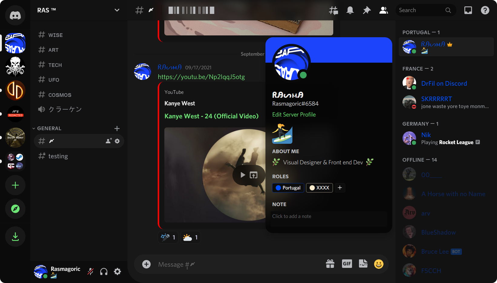

# Discord-Glass
- A css theme that improves Discord's aesthetics. 
- ✔️ True Dark mode ✔️ lots of Blur ✔️ Better Design 
- ✔️ Works with Light Mode if you want

## How to Use

**1) Install the `stylus` extension for your browser.**
  - Firefox : https://addons.mozilla.org/en-US/firefox/addon/styl-us/
  - Chrome : https://chrome.google.com/webstore/detail/stylus/clngdbkpkpeebahjckkjfobafhncgmne

**2)** Go to `write a new style` in your `stylus` extension and paste the content of the `DiscordGlass.css` file ✔️
  - https://raw.githubusercontent.com/Rasmagoric/Discord-Glass/main/DiscordGlass.css

**3) If you use FireFox :**
  - Go to `about:config` url and set `layout.css.backdrop-filter.enabled` to `true` to enable the blur effects.

##

- (note in the screenshots the zoom is set to 140%)

- If you enjoy this theme and use it daily feel free to tip:
  https://www.paypal.com/paypalme/RicardoAAP

